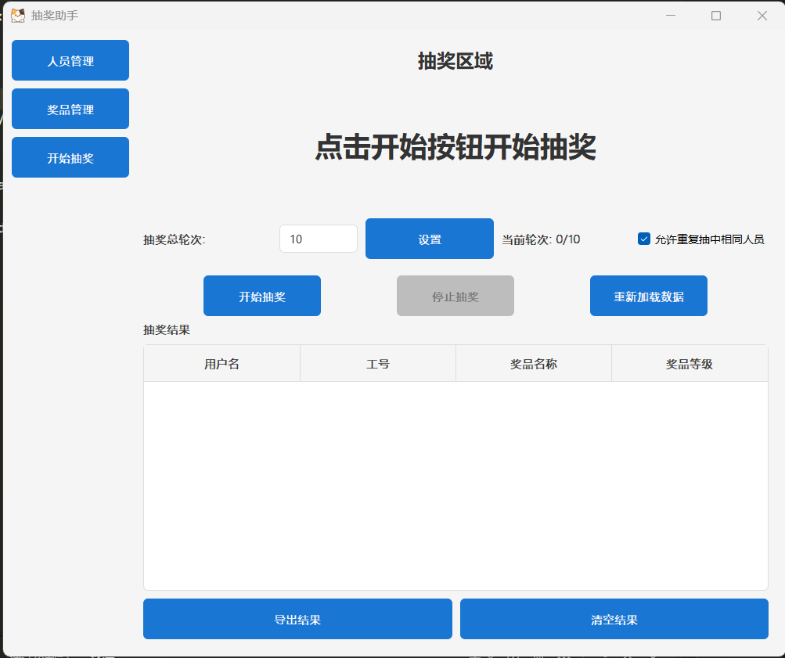

# 抽奖助手 (LotteryAssist)

一个功能强大、界面友好的企业抽奖管理工具，基于PyQt5开发，支持人员管理、奖品管理、中奖概率设置和抽奖功能。

## 🎯 功能特点

### 核心功能
- **人员管理**：添加、修改、删除、批量导入、模糊查询用户信息
- **奖品管理**：添加、修改、删除、批量操作、模糊查询奖品信息
- **中奖概率管理**：设置用户中奖概率，支持必中/必不中设置
- **抽奖功能**：基于设置的概率进行公平抽奖，自动记录中奖结果

### 技术优势
- **现代化GUI**：基于PyQt5开发，界面美观直观
- **数据持久化**：使用SQLite数据库存储数据，安全可靠
- **MVVM架构**：采用Model-View-ViewModel设计模式，代码结构清晰
- **批量操作**：支持人员和奖品的批量导入和删除
- **模糊查询**：支持按用户名和奖品名称进行模糊搜索

## 🛠 技术栈

| 类别 | 技术/框架 | 版本 |
|------|----------|------|
| 编程语言 | Python | 3.12+ |
| GUI框架 | PyQt5 | 5.15+ |
| 数据库 | SQLite3 | 内置 |
| 打包工具 | Nuitka | 2.8+ |
| 代码风格 | PEP 8 | 规范 |

## 📦 快速开始

### 方法一：直接运行可执行文件

1. 下载 `LotteryAssist.exe` 可执行文件
2. 双击运行即可，无需安装Python环境

### 方法二：从源码运行

1. **克隆项目**
   ```bash
   git clone https://github.com/laosunmaker/LotteryAssist.git
   cd LotteryAssist
   ```

2. **安装依赖**
   ```bash
   pip install -r requirements.txt
   ```
3. **运行项目**
   ```bash
   python app.py
   ```

## 📖 使用指南

### 1. 人员管理

- **添加用户**：点击"添加"按钮，输入用户名和工号
- **修改用户**：在用户列表中选择用户，点击"编辑"按钮
- **删除用户**：在用户列表中选择用户，点击"删除"按钮
- **批量导入**：点击"批量导入"按钮，选择包含用户信息的CSV文件
- **模糊查询**：在搜索框中输入关键词，点击"查询"按钮
- **批量删除**：选择多个用户，点击"批量删除"按钮

### 2. 奖品管理

- **添加奖品**：点击"添加"按钮，输入奖品名称、等级和数量
- **修改奖品**：在奖品列表中选择奖品，点击"编辑"按钮
- **删除奖品**：在奖品列表中选择奖品，点击"删除"按钮
- **批量操作**：支持批量导入和删除奖品
- **模糊查询**：在搜索框中输入关键词，点击"查询"按钮

### 3. 中奖概率管理

- **设置概率**：选择用户，设置中奖可能性（0-默认，1-必中，2-必不中）
- **设置必中奖品**：对于必中的用户，可以指定必中的奖品

### 4. 开始抽奖

- **启动抽奖**：点击"开始抽奖"按钮
- **停止抽奖**：点击"停止"按钮，系统会根据设置的概率选出中奖者
- **查看结果**：抽奖完成后会显示中奖结果

## 📁 项目结构

```
LotteryAssist/
├── app.py                 # 主程序入口
├── db/                    # 数据库相关
│   ├── __init__.py
│   └── sqlite_db.py       # SQLite数据库封装
├── main_logic/            # 主要业务逻辑
│   ├── __init__.py
│   └── batch_importer.py  # 批量导入功能
├── manager/               # 数据管理层
│   ├── __init__.py
│   ├── prize_manager.py   # 奖品管理
│   ├── user_manager.py    # 用户管理
│   └── winner_manager.py  # 中奖者管理
├── view_models/           # 视图模型层
│   ├── __init__.py
│   ├── lottery_view_model.py    # 抽奖视图模型
│   ├── prize_view_model.py      # 奖品视图模型
│   ├── probability_view_model.py # 概率视图模型
│   └── user_view_model.py       # 用户视图模型
├── views/                 # 视图层
│   ├── __init__.py
│   ├── lottery_view.py    # 抽奖界面
│   ├── prize_view.py      # 奖品界面
│   ├── probability_view.py # 概率设置界面
│   └── user_view.py       # 用户界面
├── docs/                  # 文档
│   └── imgs/              # 图片资源
├── style.qss              # 样式文件
├── cat.ico                # 应用图标
├── make_exe.bat           # 打包脚本
└── README.md              # 项目说明
```

## 📸 截图展示

### 抽奖界面



### 概率修改界面


## 🔧 开发指南

### 开发环境搭建

1. **安装Python 3.12+**
2. **安装依赖**
   ```bash
   pip install -r requirements.txt
   ```

3. **运行开发版本**
   ```bash
   python app.py
   ```

### 打包项目

使用Nuitka打包工具将项目打包为可执行文件：

```bash
# 运行打包脚本
./make_exe.bat
```

打包完成后，可执行文件会生成在 `out` 目录中。

## 📄 许可证

本项目采用 GPLv3.0 许可证 - 查看 [LICENSE](LICENSE) 文件了解详情

**许可证说明：**
- ✅ 您可以自由使用、修改和分发本软件
- ✅ 所有修改后的版本必须同样使用 GPLv3.0 许可证
- ✅ 分发时必须提供源代码
- ⚠️ 不能将本软件闭源后商业使用

## 📞 联系作者

- **项目维护者**：lsmaker
- **邮箱**：1650562331@qq.com
- **QQ**: 1650562331
- **微信号**：lsmaker
- **GitHub**：[https://github.com/laosunmaker](https://github.com/laosunmaker)

---

**如果本项目对您有帮助，请给个 ⭐ 支持一下！**